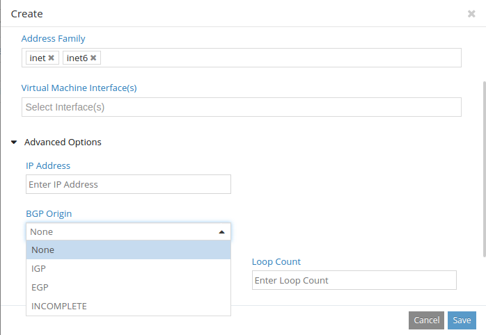
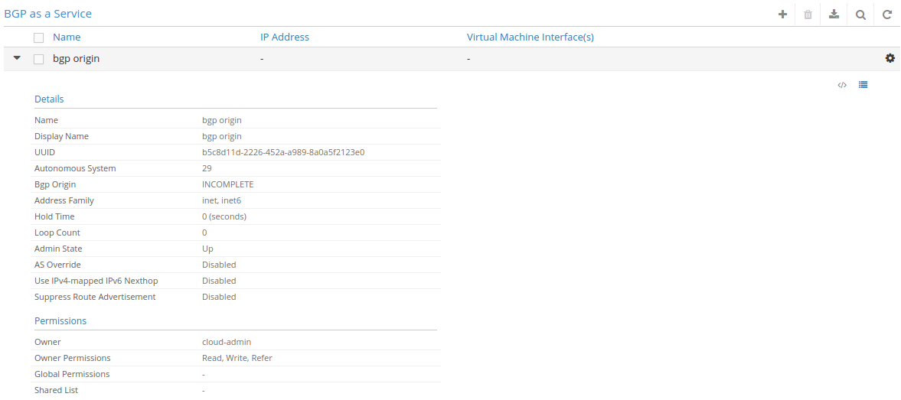
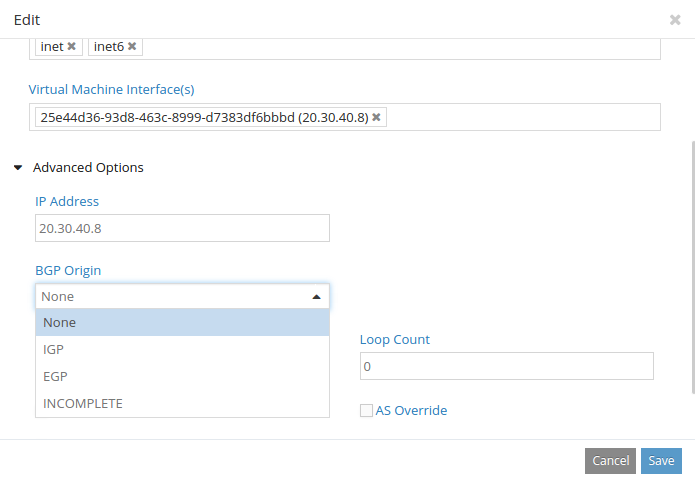

#1. Introduction

The contrail BGP implementation was designed from scratch to run on modern 
server environments. The main goals were to be able to take advantage of 
multicore CPUs, large (>4G) memory footprints and modern software development 
techniques.

BGP can be divided in the following components:

1. **Input processing**: decoding and validating messages received from each 
peer.
2. **Routing table operations**: modifying the routing table and determining 
the set of updates to generate.
3. **Update encoding**: draining the update queue and encoding messages to a 
set of peers.
4. **Management operations**: configuration processing and diagnostics.

This blueprint provides a detailed description on defining a new origin field 
by:

1. Making changes in Contrail configuration files.
2. Making changes in Contrail GUI.
3. Making changes in controller.

All of these steps are to be performed for the new functionality to work 
successfully.

#2. Problem statement
###Normalize route origin when learning routes from a VM/VNF.
This feature request is related to BGP as a Service (i.e. the vRouter peering 
with a VNF running in a VM). It concerns the route origin field in BGP. On 
PNF routers it is possible to override the route origin field of incoming 
routes that are learned from peers. This same capability is needed when 
Contrail learns routes from VNFs. In particular, this is related to the vLB 
VNF because VNF does NOT want route origin to be part of the tiebreaker 
protocol when choosing between routes. It is necessary to be able to set the 
route origin field of routes learned from vLB VNFs to a single value across 
entire network so that differences in route origin value between different 
vLB instances won't contribute to route selection.

#3. Proposed solution
Contrail by default exposes certain configurable options to the admin in 
management console which are eventually used by underlying service when 
making certain decisions or creating packets. In order to make origin field 
configurable, following set of changes are needed:

+ Expose a configurable option (Origin) in BGPaaS admin UI

##3.1 Alternatives considered
Describe pros and cons of alternatives considered.

##3.2 User workflow impact

Contrail GUI allows the user define a new route origin with multiple options. 
User can click advanced options in Create to view the BGP Origin field. It 
has four options: IGP, EGP, INCOMPLETE or NONE to be selected by the user.

##3.3 UI changes

Details in section 4.1 below.

##3.4 Notification impact

There were no changes made in logs, UVEs or alarms.

#4. Implementation
##4.1  Work items

It has 4 modules. The GUI changes are mentioned below.

The rest are defined in contrail-controller repo README.md

###4.1.1 UI changes

These steps are to be followed to make changes in contrail GUI to reflect the 
impact of modifications in schema:

+ Declare bgp_origin as optional field in file 
**webroot/common/api/jsonDiff.helper.js** in optFields.

+ Declare bgp_origin format in 
**webroot/config/services/bgpasaservice/ui/js/bgpAsAServiceFormatter.js**, 
which is called by frontend to show appropriate bgp origin value.

+ In ContrailConfigModel, add bgp_origin in defaultConfig which is present in 
this file: 
**webroot/config/services/bgpasaservice/ui/js/models/bgpAsAServiceModel.js**.

String value from frontend is converted into integer value to be sent to the 
backend.
Then the value received at frontend is validated that whether it is 0, 1, 2 
or 3.

+ To add a new field on the GUI, the structure of a drop down menu is defined 
in 
**webroot/config/services/bgpasaservice/ui/js/views/bgpAsAServiceEditView.js**.
 This enables different options i.e. IGP, BGP, ICOMPLETE and NONE to be 
visible in the drop down menu at Edit View on GUI.

+ To make the BGP origin value visible in the Grid View, changes are made in 
**webroot/config/services/bgpasaservice/ui/js/views/bgpAsAServiceGridView.js**.

+ The value of BGP origin is bonded with BGP origin formatter by making 
changes in “this.bgpOrigunViewFormattter” function.

By making the above mentioned changes, the BGP Origin Field will become 
configurable in the UI.
On frontend, we get field of **BGP origin** in the tabs **Create**, **Edit** 
and **Grid view**. BGP origin field is also visible in the tab “BGP as a 
service.”

An object is passed from frontend to API Server when we create BGP as a 
service.

Details in contrail-controller repo README.md

#5. Performance and scaling impact
##5.1 API and control plane

There are no changes in scalability of API and Control Plane.
##5.2 Forwarding performance
We do not expect any change to the forwarding performance.

#6. Upgrade
The BGP origin field is a new field and hence does not have any upgrade impact.

#7. Deprecations
There are no deprecations when this change is made.

#8. Dependencies
There are no dependencies for this feature.

#9. Testing
##9.1 Unit test

GUI unit test: Check if values are visible on frontend and are passed to the 
backend.

##9.2 Dev test

Flow Test Steps:

+ Check if value of BGP origin is received from frontend.

These tests were completed successfully.

#10. Documentation Impact
BGP origin field details have to be added in user documentation.

#11. References
[bgp_design](http://juniper.github.io/contrail-vnc/bgp_design.html)

[adding-bgp-knob-to-opencontrail](http://www.opencontrail.org/adding-bgp-knob-to-opencontrail/)

[contrail-controller (source-code)](https://github.com/Juniper/contrail-controller/tree/master/src/vnsw/agent)
