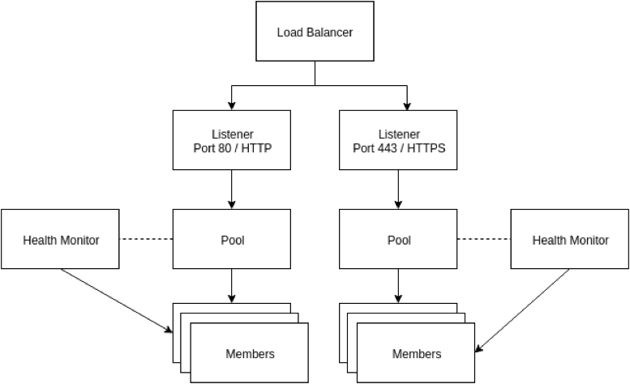
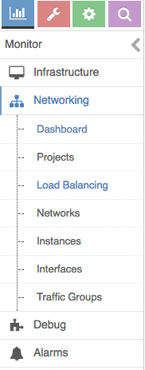
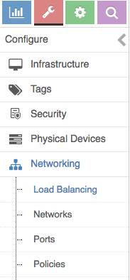
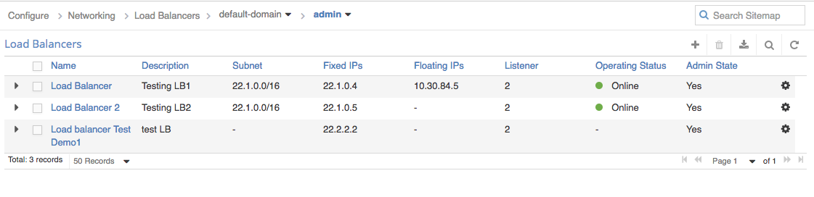
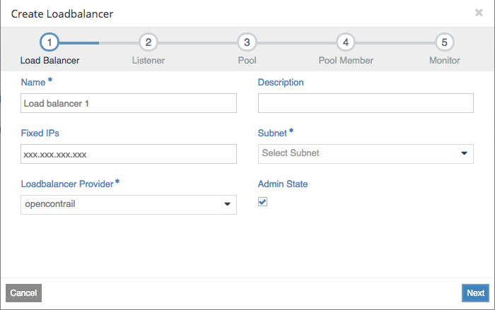
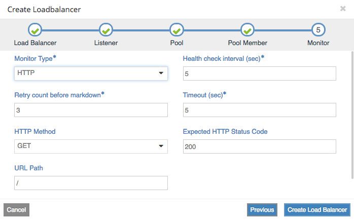
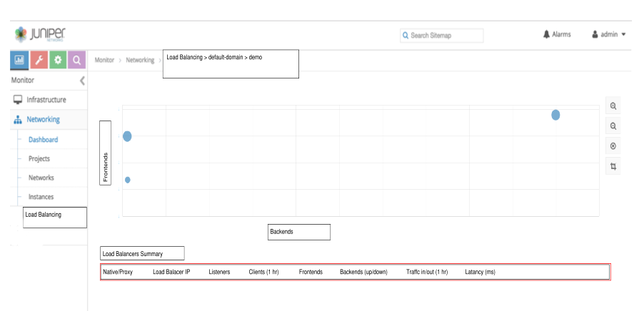
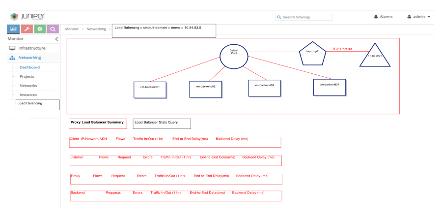

## 1. Introduction
This blue print describes the design, features, and implementation of Load-Balancer-as-a-Service (LBaaS) feature in Contrail Web UI.

Load-Balancer-as-a-Service (LBaaS) enables networking to distribute incoming requests evenly among designated instances. This distribution ensures that the workload is shared predictably among instances and enables more effective use of system resources. Use one of these load-balancing methods to distribute incoming requests:
*	Round robin: Rotates requests evenly between multiple instances.
*	Source IP: Requests from a unique source IP address are consistently directed to the same instance.
*	Least connections: Allocates requests to the instance with the least number of active connections.

As an end user, you can create and manage load balancers and related objects for users in various projects. You can also delete load balancers and related objects.

* Load balancer 
The load balancer occupies a neutron network port and has an IP address assigned from a subnet.
* Listener 
Load balancers can listen for requests on multiple ports. Each one of those ports is specified by a listener.
* Pool  
A pool holds a list of members that serve content through the load balancer.
* Member  
Members are servers that serve traffic behind a load balancer. Each member is specified by the IP address and port that it uses to serve traffic.
* Health monitor  
Members may go offline from time to time and health monitors divert traffic away from members that are not responding properly. Health monitors are associated with pools

## 2. Problem Statement
User should be able to monitor and configure LBaaS as per their requirement.

## 3. Proposed Solution
It is proposed to provide a new feature to configure and monitor Load-Balancer-as-a-Service (LBaaS) in Contrail UI which enables networking to distribute incoming requests evenly among designated instances. User can create, edit, delete and rename Load Balancers from configuration section.
Each Load Balancers need have
  * Load Balance info*
  * Listener info*
  * Pool details*
  * Pool Members
  * Monitor Details*
 ### 3.1 Configure Load Balancer:
The load balancer occupies a network port and has an IP address assigned from a subnet and a provider.
#### 3.1.1 Listener
Each port that listens for traffic on a particular load balancer is configured separately and tied to the load balancer. Multiple listeners can be associated with the same load balancer.
#### 3.1.2 Pool
A pool is a group of hosts that sits behind the load balancer and serves traffic through the load balancer.
#### 3.1.3 Member
Members are the actual IP addresses that receive traffic from the load balancer. Members are associated with pools.
#### 3.1.4 Health monitor
Members may go offline from time to time and health monitors diverts traffic away from members that are not responding properly. Health monitors are associated with pools.

### 3.2 Monitor Load Balancer:
It is to provide overview of all Load Balancers in the system, including HAProxy Load Balancing (Active-Standby or Active-Active).

* Each HAProxy Load Balancer can have multiple pools, with one or more listeners for every pool. Traffic and Latency Information can be collected from a HAProxy instance (L4 and L7), or from the vRouter on a Floating IP basis. Client Information can be collected from the vRouter.

### 3.3 Alternatives considered
TBD

### 3.3 API schema changes
None

### 3.4 UI changes
New Feature

### 3.5 Notification impact
None

## 4. Implementation

### 4.1 Navigation Link
* Add a new Load Balancers link in sidebar to Monitor.

* Add a new Load Balancers Link in sider to Configure.

### 4.2 Workflow to create a Load Balancer

#### 4.2.1 Create a new Load Balancer.
Navigate to **Configure** workspace and under **Networking** section, you see **Load Balancer**
* Click on “+”

**Create Load Balancer Wizard**

**Step 1 - Load Balancer Details:** The subnet is the network on which to allocate the load balancer's IP address. If an IP address is provided it must be a well-formed IPv4 or IPv6 address. The system will attempt to assign the provided IP address to the load balancer.
  * Name: optional
  * Description: optional
  * IP address: optional
  * Provider : opencontrail/(native different workflow) (Service Appliance Sets) default opencontrail
  * Subnet: Drop Down required (Display all Subnets from list of all Networks)
  Note:
  * Each Proxy Load Balancer can have multiple pools with one or more listeners for every pool
  * Native Load Balancer has a single pool, shared among multiple listeners

**Step 2 - Listenser Details:** A listener represents a listening endpoint for a load balancer. A single load balancer can have multiple listeners.
1. Name: optional The default value for this attribute will be an empty string.
2. Description: optional
3. Protocol: Drop Down  required (HTTP, TCP, TERMINATED_HTTPS)
4. Port: required The port in which the frontend will be listening. Must be an integer in the range of 1-65535
    (When user select TERMINATED_HTTPS need to have select SSL Certificates)
    1. List of Allocated Certificates
    2. Certificate Name , Expiration Date.
    3. List of Available Certificates
    4. Certificate Name, Expiration Date.
5. Admin State (UP/DOWN): The default value for this attribute is true.
6. connection_limit: The default value for this attribute will be -1, indicating an infinite limit.
NOTE: The TERMINATED_HTTPS protocol is only available if the key-manager service is enabled and you have authority to list certificate containers and secrets.

**Step 3 - Pool Details:**	 A pool represents a group of members over which the load balancing will be applied.
1. Name: Optional
2. Description: optional
3. Method: Drop Down  Required (LEAST_CONNECTIONS, ROUND_ROBIN, SOURCE_IP)
4. Protocol: Required The protocol this pool and its members will be listening for. Must be one of TCP, HTTP, or HTTPS
5. admin_state_up: The default value for this attribute is true.
6. session_persistence: optional The default value for this is an empty dictionary.

**Step 4 - Pool Members:**  The Available Instances table contains existing instances that can be added as members of the pool. Use the "Add external member" button to add a member not found in the Available Instances table. Each member must have a unique combination of IP address and port.
There are two ways user can add Members
1. Add External member (List) : Optional
    *	Enter IPAddress, Subnet, Port, Weight
2.	Available Instance (List): Optional

1. address: The IP Address of the member to receive traffic from the load balancer.
2. protocol_port: The port that the member is listening to receive traffic..
3. subnet_id: The subnet in which to access the member
   Some attributes will receive default values if not specified in the request:
4. admin_state_up: The default value for this attribute is true.
5. weight: The default value for this attribute will be 1.

**Step 5 - Monitor Details:**
1. Monitor type: Drop Down required (HTTP,HTTPS, PING, TCP)
    * When user select HTTP: need additional inputs
	* HTTP method: Drop Down GET,HEAD Default(GET)
	* Expected HTTP Status code :  Default(200)
    * URL Path: default (/)
2. Health check interval(sec): required
3. Retry count before markdown: required
3. Timeout(sec): required

4. delay: The interval in seconds between health checks.
5. max_retries: Number of failed health checks before marked as OFFLINE.
5. admin_state_up: The default is true.

Note: Custom attributes need to be added to this wizard.

#### 4.2.2 Edit a Load Balancer

1. Load Balancer Details:
    * User can edit only
	* name
	* description
	* admin_state_up
    * Before deleting the Load Balancer first we need delete the Listener
2. Listener Details:
    * User can edit only
    * name
	* description
	* admin_state_up
	* connection_limitName and Description
    * Before deleting the Listener first we need delete the Pool
3. Pool Details:
    * User can edit only
    * name
	* description
	* admin_state_up
	* Method
	* session_persistence
    * Before deleting the Listener first we need delete the Pool Members
4. Pool Members Details:  
    * User can add or Delete the existing members
    * weight
	* admin_state_up
5. Monitor Details
    * User can Delete the Monitor
    * delay
	* timeout
	* max_retries
	* http_method
	* url_path
	* expected_codes
	* admin_state_up

#### 4.2.4 Operations:
Additional Operations
  * Associated floating IP address.

### 4.3 Monitor Load Balancers
This is an overview of all Load Balancers (IPs) in the system, including Proxy Load Balancers (Active-Standby or Active-Active).

#### 4.3.1
This is a summary of one particular Proxy Load Balancing Instance.

### 4.4 Work items

* Create a new wizard based approach to create Load Balancers
* Create Load Balancers Monitor Dashboard
* Web-server side REST API for client to interact with VNC Objects
* Required enhancement of test-case framework (if any)
* Unit, Acceptance, System, and Regression test-cases

## 5. Performance and scaling impact
TBD

## 6. Upgrade
**N/A**

## 7. Deprecations
**N/A**

## 8. Dependencies
**N/A**

##9. Testing
Our current UI system testing infrastructure allows mocking a backend server and simulating user actions on UI components and asserting the required result. This section will introduce testing of Load Balancer feature.

### 9.1 Unit Testing
Basic unit testing of model and utility functions and make sure validation is properly ensured and other error/null cases are handled.

### 9.2 Acceptance/Integration Testing
TBD
### 9.3 System Testing
TBD

## 10. Limitations
TBD

## 11. Documentation Impact
UI documentation needs to be updated to provide information on usage of LBaaS.

## 12. References
* https://docs.openstack.org/horizon/latest/user/manage-lbaasv2.html
* https://wiki.openstack.org/wiki/Neutron/LBaaS
